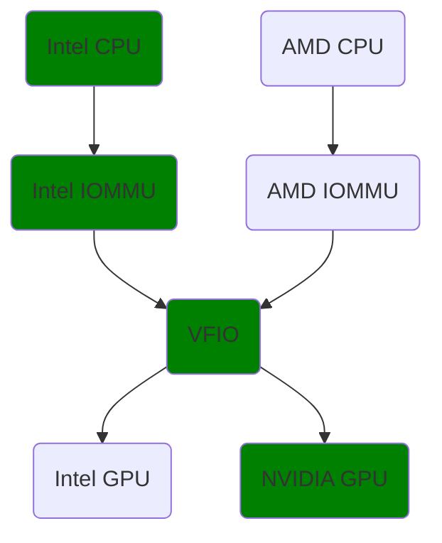
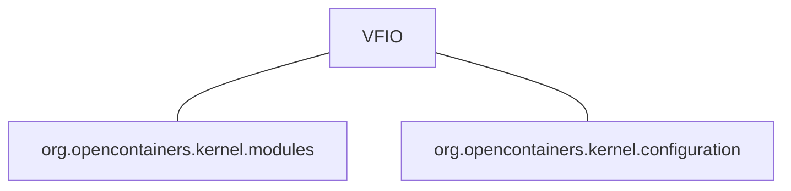

# Proposal B - Compatibility Artifact for nodes validation and community projects

This proposal introduces a new image compatibility artifact type.
The first part of the proposal focuses on the artifact and representation of compatibility with the proposed language.
The second part concerns the tool to be maintained by the OCI orgnization.
Finally, the last part shows the possible usage scenarios.

## Image Compatibility Artifact

The purpose of the compatibility artifact is to describe CRITICAL requirements for container images to run on a host, if any.
It is NOT TO store variation of user configuration of applications and image compatibility on a node.

### Artifact Manifest

The proposal introduces a new artifact `application/vnd.oci.image-compatibility.v1` and compatibility spec  `application/vnd.oci.image-compatibility.spec.v1+json` media type.

The compatibility spec must be interpreted by a dedicated software.

```json
{
  "schemaVersion": 2,
  "mediaType": "application/vnd.oci.image.manifest.v1+json",
  "artifactType": "application/vnd.oci.image-compatibility.v1",
  "config": {
    "mediaType": "application/vnd.oci.empty.v1+json",
    "digest": "sha256:44136fa355b3678a1146ad16f7e8649e94fb4fc21fe77e8310c060f61caaff8a",
    "size": 2
  },
  "layers": [
    {
      "mediaType": "application/vnd.oci.image-compatibility.spec.v1+json",
      "digest": "sha256:4a47f8ae4c713906618413cb9795824d09eeadf948729e213a1ba11a1e31d052",
      "size": 1710
    }
  ],
  "annotations": {
    "oci.opencontainers.image.created": "2024-01-02T03:04:05Z"
  }
}
```

### Relation of the Artifact to Image Manifest

```
 Image Index                                                 
 +----------------------------------------------------------+
 |                                                          |
 |  Image Manifest A             Image Manifest B           |
 |  +-----------------------+    +-----------------------+  |
 |  |platform:              |    |platform:              |  |
 |  |  archictecture: amd64 |    |  archictecture: arm   |  |
 |  |  os: linux            |    |  os: linux            |  |
 |  |                       |    |                       |  |
 |  |digest: abc123         |    |digest: def456         |  |
 |  +--------------------|--+    +--------------------|--+  |
 |                       |                            |     |
 +-----------------------|----------------------------|-----+
                         |                            |      
                         |                            |      
    Artifact A           |       Artifact B           |      
    +--------------------|--+    +--------------------|--+   
    |                    |  |    |                    |  |   
    | Subject Descriptor |  |    | Subject Descriptor |  |   
    | +------------------|-+|    | +------------------|-+|   
    | | digest: abc123     ||    | | digest: def456     ||   
    | +--------------------+|    | +--------------------+|   
    |                       |    |                       |   
    +-----------------------+    +-----------------------+   
```

The design imposes a strong 1 to 1 relationship between the compatibility artifact and the image.
That allows users to independently release artifacts and attach compatibility to the already existing images.

The disadvantage of this solution is that you cannot create compatibility that points to multiple images having the same requirements.

### Artifact Discovery

If a registry supports referrers API, it should be used for the artifact discovery.

Otherwise, the fallback method on the client said shall be implemented.
The client:
1. Fetches the image index.
1. Iterates over descriptors to check if it's compatibility artifact type.
1. Validates the subject descriptor to check the correct image reference.

### Compatibility Spec

Compatibility spec (`application/vnd.oci.image-compatibility.spec.v1+json`) must represent compatibility requirements and their relations to each other, nothing more.
The relations may vary depending on specific conditions such as hardware, operating system etc. 

The specification:
- Should not put any context into the data structure other than mentioned above.
- The context appliance should be done by tools that implements specific use cases (for example schedulers, tools to provision nodes etc.).
- If required, tools that implements specific use cases should transform data to their needs in their own sandbox.

Additionally, an official OCI tool with MINIMAL scope and libraries should be developed by OCI Image Compatibility maintainers.
For more details, check [OCI Compatibility Tool](#oci-compatibility-tool) section.

#### DAG and Compatibility Groups

The following example demonstrate compatibility spec represented by DAG with nodes where one node represents a compatibility group.

- Container requirements to run VM with GPU passthrough - validated on the host with Intel CPU and NVIDIA GPU



#### Compatibility Domains

Compatibility domains are part of compatibility group, and provides data called `facts` that describes container requirements against the host OS. These data can be used by many contexts and tools.

- VFIO compatibility group (DAG node) containing compatibility domains



Check the next section with [the example](#example-of-use) to see real compatibility spec usage.

#### Language proposal to represent compatibility

- **`spec`** *string-object map*

  This REQUIRED property describes the compatibility specification.

  - **`<compatibilityGroup>`** *object*

    This REQUIRED property specifies the compatibility group (a DAG node).

    - **`compatibilities`** *string-object*

      This OPTIONAL property is a list of compatibility domains.

      - **`<compatibilityDomain>`** *object*

        This REQUIRED property specifies the compatibility domain. Unit names are used to identify origin of data and its funcionality. The name must be a valid domain name.

        - **`annotations`** *string-string map*

          This OPTIONAL property specifies optional annotations.

        - **`facts`** *object*

          This REQUIRED property describes data that reflects container requirements against the host OS. Allowed fields must be described in the documentation of the compatibility domain.

    - **`relation`** *object*

      This OPTIONAL property specifies the relation to other compatibility groups (DAG nodes).

      - **`all`** *array of strings*

        This OPTIONAL property specifies a list of all required compatibility groups that must pass that container is considered to be compatible with a host.

      - **`oneOf`** *array of strings*

        This OPTIONAL property specifies a list of compatibility groups with a condition that at least one group has to pass that container is considered to be compatible with a host.

      - **`noneOf`** *array of strings*

        This OPTIONAL property specifies a list of compatibility groups that cannot pass that container is considered to be compatible with a host.

#### Example of use 

- Container running VM that requires direct access to GPU

```json
{
  "spec": {
    "intelCpu": {
      "compatibilities": {
        "org.opencontainers.hardware.cpu": {
          "facts": {
            "vendor": "GenuineIntel",
            "virtualization": "VT-x"
          }
        }
      },
      "relation": {
        "all": ["intelIommu"]
      }
    },
    "intelIommu": {
      "compatibilities": {
        "org.opencontainers.kernel.cmdline": {
          "facts": {
            "intel_iommu": "on"
          }
        }
      },
      "relation": {
        "all": ["vfio"]
      }
    },
    "amdCpu": {
      "compatibilities": {
        "org.opencontainers.hardware.cpu": {
          "facts": {
            "vendor": "GenuineIntel",
            "virtualization": "AMD-V"
          }
        }
      },
      "relation": {
        "all": ["amdIommu"]
      }
    },
    "amdIommu": {
      "compatibilities": {
        "org.opencontainers.kernel.cmdline": {
          "facts": {
            "amd_iommu": "pt"
          }
        }
      },
      "relation": {
        "all": ["vfio"]
      }
    },
    "vfio": {
      "compatibilities": {
        "org.opencontainers.kernel.modules": {
          "facts": {
            "vfio": {},
            "vfio_iommu_type1": {},
            "vfio-pci": {}
          }
        }
      },
      "relation": {
        "oneOf": ["intelGpu", "nvidiaGpu"]
      }
    },
    "intelGpu": {
      "compatibilities": {
        "org.opencontainers.hardware.pci": {
          "facts": {
            "class": "0380",
            "vendor": "8086"
          }
        },
        "org.opencontainers.kernel.configuration": {
          "facts": {
            "CONFIG_DRM": "y",
            "CONFIG_DRM_I915": "y",
            "CONFIG_DRM_I915_USERPTR": "y",
            "CONFIG_DRM_I915_GVT": "m",
            "CONFIG_DRM_I915_GVT_KVMGT": "m"
          }
        },
        "org.opencontainers.kernel.modules": {
          "facts": {
            "kvmgt": {
              "enable_gvt": 1
            }
          }
        }
      }
    },
    "nvidiaGpu": {
      "compatibilities": {
        "org.opencontainers.hardware.pci": {
          "facts": {
            "class": "0380",
            "vendor": "10de"
          }
        },
        "org.opencontainers.kernel.configuration": {
          "CONFIG_HOTPLUG_PCI_PCIE": "y",
          "CONFIG_MODULES": "y",
          "CONFIG_MODULE_UNLOAD": "y",
          "CONFIG_PCI_MMCONFIG": "y",
          "CONFIG_DRM_NOUVEAU": "n"
        }
      }
    }
  }
}
```

## OCI Compatibility Tool

The compatibility tool maintained by OCI should be very minimal in scope
and it should export pkgs for external tools so they can cover their own use cases.

The suggested scope of functionality should be as follows:
- create artifact
- pull and push artifact
- validate compatibility specification
- validate host
- output the compatibility spec in a readable form

### Implementation

The tool should be written in Golang and implement in-tree plugins architecture. 

The structure should be similar to:

```
cmd/
pkg/
  cmd/
  plugins/
    core/
    community/
      org.telco/
      org.supercontainers/
      ...
  schema/
```

- cmd/ - provided cmds
- pkg/cmd - all cmds should be written in a form that they can be exported
- pkg/plugins - plugins extracts and validates information on the host.
  They must match compatibility domains from the compatibility spec.
  For instance `org.opencontainers.kernel.module` should be able to list and validate kernel modules on the host.
- pkg/plugins/core - all core plugins maintained by OCI under `org.opencontainers` domain
- pkg/plugins/community - all community plugins with their own domains with schema.
  Community maintainers will have access to their own domain directory.
- pkg/schema - schema with graph implementation

### Core Plugins

The following subjects should be added to core plugins list that are maintained by OCI group:

- CPU
- Kernel
- Memory
- Network
- PCI
- USB
- Storage
- System

That is duplicated from the [Node Feature Discovery](https://github.com/kubernetes-sigs/node-feature-discovery/tree/master/source) project.
There is a possibility that we could cooperate with NFD community, contribute and import source code responsible for features detection.

### Security

- Linux hosts should be protected by AppArmor/SELinux profiles/policies written by maintainers.
- Each plugin should have its own section in the profile.
- The profiles must be carefully reviewed by the maintainers.

The proposal doesn't have a solution for Windows or illumos.
This can be determined later with Windows and illumos experts.

## Usage

### Goals

The primary usage is only to validate host against the compatibility spec.
Consider the following scenario:

1. Image author creates an image with a compatibility artifact
2. Image author pushes the image and the artifact to the registry
3. Sysadmin pulls the artifact with compatibility spec over the tool.
4. Sysadmin executes the validate-host cmd provided by the tool (directly on the host).
5. Sysadmin gets immediate information if the image is compatibile with the host.

### Non-goals

The proposal intention is to keep the tool and specification very simple.
Thus the following scenarios are out of the scope:

- Implement any logic, algorithms or helpers for
  - External schedulers (like k8s)
  - Node provisioning
  - Image selection
  - etc.

All uses cases that require compatibility information should implement their own logic, algorithms or helpers in separate projects.
As mentioned in the [OCI Compatibility Tool](#oci-compatibility-tool) section: _The compatibility tool maintained by OCI should be very minimal in scope and it should export pkgs for external tools so they can cover their own use cases._

## Requirements

TBD: pending the completion of the requirements.
