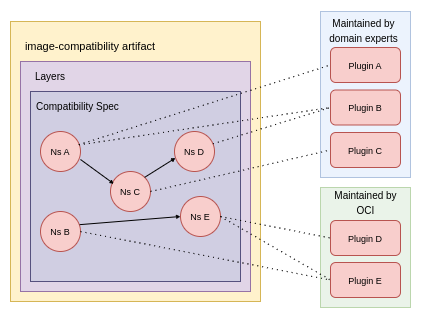
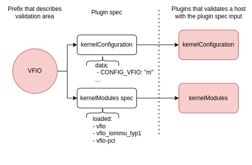
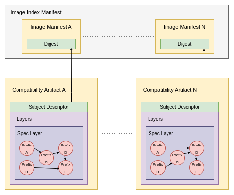

# Proposal B - Extend Platform Variants and Introduce Compatibility Artifact

This proposal recommends changes to image spec for more granular image selection and introduces a new image compatibility artifact type.
Based on the artifact, cluster administrators can verify hosts or prepare the appropriate infrastructure for containers.

## Modifications

### Image Spec

Extend the platform variants with new ARM and AMD64 micro-architecture levels.

| ISA/ABI          | architecture | variant |
|------------------|--------------|---------|
| ...              | ...          | ...     |
| ARM 64-bit, v9   | arm          | v9      |
| AMD64 64-bit, v2 | amd64        | v2      |
| AMD64 64-bit, v3 | amd64        | v3      |
| AMD64 64-bit, v4 | amd64        | v4      |

## Image Compatibility Artifact



### Definitions

- image-compatibility artifact - an OCI artifact that stores the compatibility spec.
- Compatibility Spec - a json object that represents a graph of namespaces.
- Namespace - a validation area under which users can describe plugin specs that are consumed by plugins (executable binaries) as input.
- Plugin - an executable binary that extracts data and checks compatibility on a host.

A new imageCompatibility artifact type that contains a layer with a JSON compatibility object.
The object represents a graph of namespaces.
Namespace describes the validation area and is another object containing data that provides plugins specification for the corresponding plugins.
A plugin is an executable binary that validates the host and returns information about success or failure.

### Compatibility Spec

Compatibility spec is a graph that can have multiple roots with different paths.
If one namespace in the path fails, the path is incompatible with the host.
Namespace fails if at least one plugin reports an error.
If all paths fail, the host is not compatible with the container.

The host is compatible with the container if at least one path is completed successfully.

#### Schema

- **`schemaVersion`** *string*

  This REQUIRED property specifies the image manifest schema version. For this version of the specification.

- **`namespaces`** *string-object map*

  This REQUIRED property specifies a map of validation areas.

  - **`<namespace-name>`** *object*

    This REQUIRED property specifies the validation area.

    - **`plugins`** *string-object*

      This OPTIONAL property is a list of plugins specifications.

      - **`<plugin-name>`** *object*

        This REQUIRED property specifies the plugin specification for plugin executable binary that validates the host and returns information about success or failure

        - **`source`** *string*

        This OPTIONAL property specifies an HTTP address of the plugin.

        - **`data`** *object*

        This OPTIONAL property specifies the input data for plugin executable binary.

    - **`refs`** *object*

      This OPTIONAL property specifies the references to other namespaces.

      - **`all`** *array of strings*

        This OPTIONAL property specifies a list of all required namespaces that have to pass that container is considered to be compatible with a host.

      - **`oneOf`** *array of strings*

        This OPTIONAL property specifies a list of namespaces with a condition that at least one namespace has to pass that container is considered to be compatible with a host.

      - **`noneOf`** *array of strings*

        This OPTIONAL property specifies a list of namespaces that cannot pass that container is considered to be compatible with a host.

##### Example

GPU pass-through

```json
{
  "schema": "0.1.0",
  "namespaces": {
    "kernelMainlineV5": {
      "plugins": {
        "kernelVersion": {
          "source": "<http-something-to-download-plugin>",
          "data": {
            "range": "[5.0.0,5.15.0)"
          }
        },
        "refs": {
          "all": [
            "vfio",
            "cpu",
            "gpu"
          ]
        }
      }
    },
    "vfio": {
      "plugins": {
        "kernelConfiguration": {
          "data": {
            "CONFIG_VFIO": "m",
            "CONFIG_VFIO_IOMMU_TYPE1": "m",
            "CONFIG_VFIO_MDEV": "m",
            "CONFIG_VFIO_MDEV_DEVICE": "m",
            "CONFIG_VFIO_PCI": "m"
          }
        },
        "kernelModules": {
          "data": {
            "vfio": {},
            "vfio_iommu_type1": {},
            "vfio-pci": {}
          }
        }
      }
    },
    "cpu": {
      "refs": {
        "oneOf": [
          "cpuAmd",
          "cpuIntel"
        ]
      }
    },
    "cpuAmd": {
      "plugins": {
        "hardware": {
          "data": {
            "cpu": ["AuthenticAMD"]
          }
        }
      }
    },
    "cpuIntel": {
      "plugins": {
        "hardware": {
          "data": {
            "cpu": ["GenuineIntel"]
          }
        },
        "kernelCmdline": {
          "data": {
            "intel_iommu": "on"
          }
        }
      }
    },
    "gpu": {
      "refs": {
        "oneOf": [
          "gpuNVIDIA",
          "gpuIntel"
        ]
      }
    },
    "gpuNVIDIA": {
      "plugins": {
        "hardware": {
          "data": {
            "pci": ["0380:10de"]
          }
        },
        "kernelConfiguration": {
          "data": {
            "CONFIG_HOTPLUG_PCI_PCIE": "y",
            "CONFIG_MODULES": "y",
            "CONFIG_MODULE_UNLOAD": "y",
            "CONFIG_PCI_MMCONFIG": "y",
            "CONFIG_DRM_NOUVEAU": "n"
          }
        }
      }
    },
    "gpuIntel": {
      "plugins": {
        "hardware": {
          "data": {
            "pci": ["0380:8086"]
          }
        },
        "kernelConfiguration": {
          "data": {
            "CONFIG_DRM": "y",
            "CONFIG_DRM_I915": "y",
            "CONFIG_DRM_I915_USERPTR": "y",
            "CONFIG_DRM_I915_GVT": "m",
            "CONFIG_DRM_I915_GVT_KVMGT": "m"
          }
        },
        "kernelModules": {
          "data": {
            "kvmgt": {
              "enable_gvt": "1"
            }
          }
        }
      }
    }
  }
}
```

### Namespace and Plugin



Namespaces and plugins are core functionality to evaluate if a host is compatible with a container.
They can look up existing components on a host or just serve as a data source to get additional information about specific resources (like CPU features).
Although in each case a plugin has to return information about success or failure.

The design allows you to build plugins on top of other plugins.
For instance an Nvidia GPU plugin could include logic of kernelModules and kernelConfiguration to discover if appropriate kernel modules are loaded or disabled.

#### Plugins Categorization

Plugins are developed by:

- OCI Image Compatibility maintainers (atomic plugins)
- Community (custom plugins)

Atomic plugins serve as the basis for external plugins provided by a community with expertise in specific areas.
They are divided into the following areas (similarly like in [Node Feature Discovery](https://kubernetes-sigs.github.io/node-feature-discovery/v0.15/usage/features.html#table-of-contents)):

- CPU
- Kernel
- Memory
- Network
- PCI
- USB
- Storage
- System

*Note: We could import part of the NFD project or export the common part and contribute.*

#### Distribution of Plugins

TBD: verification of the plugins

- Pulled over HTTP - from the address specified in the schema `source` field, pulled to `/opt/oci/image-compatibility/<artifact-digest/plugins`.
- Attached to artifact layers - extracted to `/opt/oci/image-compatibility/<artifact-digest/plugins`.
- User-provided - users add plugins to `/opt/oci/image-compatibility/<artifact-digest/plugins`.

### Relation of the Artifact to Image Manifest



The design dictates a strong 1 to 1 relationship between compatibility artifact and image manifest.
That allows users to independently release artifacts and attach compatibility to the already existing images.

The disadvantage of this solution is that you cannot create compatibility that points to multiple images having the same requirements.

#### Artifact Discovery

If a registry supports referrers API, it should be used for the artifact discovery.
Otherwise, the artifact could be pulled directly over a tag.

### Artifact Management and Host Validation Tool

A new tool have to be developed by OCI Image Compatibility maintainers that allows:

- Management of artifacts:
  - TBD: pending the completion of the requirements.
- Host validation:
  - TBD: pending the completion of the requirements.

## Requirements

TBD: pending the completion of the requirements.
